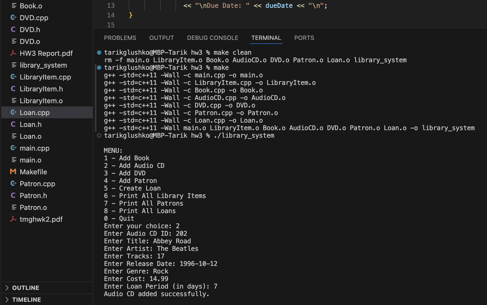

# Library-Management-System

The Library Loan Management System (LLMS) is an advanced software solution developed as part of the CSCE 1040 Homework 3 assignment. This project tackles the intricacies of efficiently managing loans from the local public library, providing a comprehensive system to streamline operations related to Patrons, Books, and Loans.

C++ Object-Oriented Programming Agile Methodologies MakeFile

